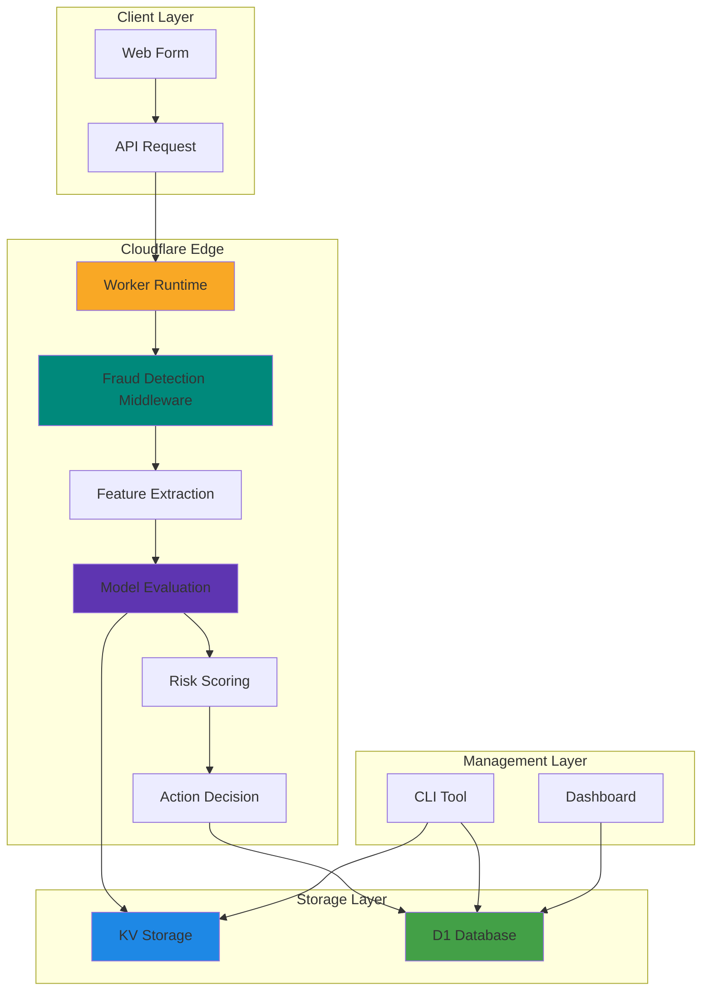
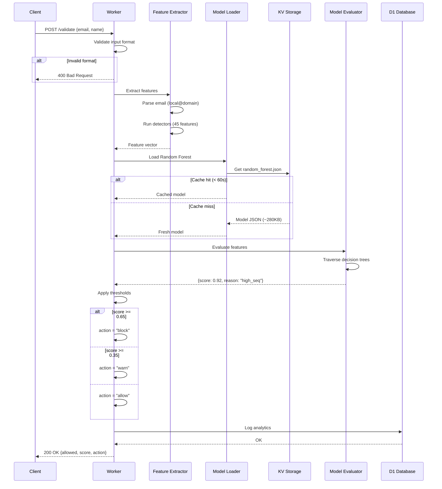
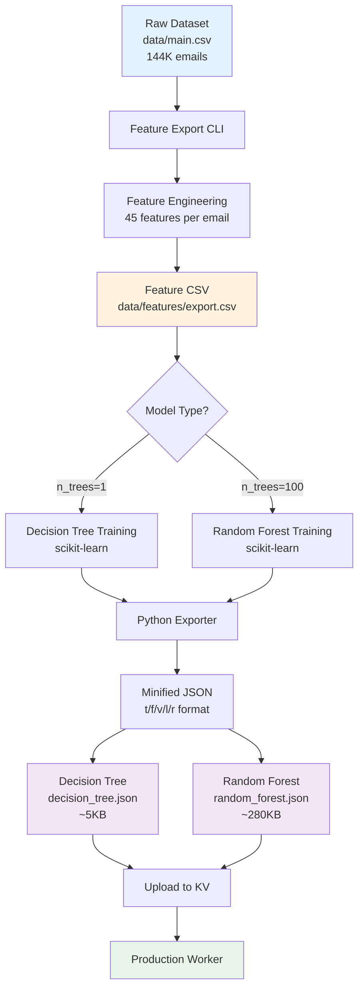
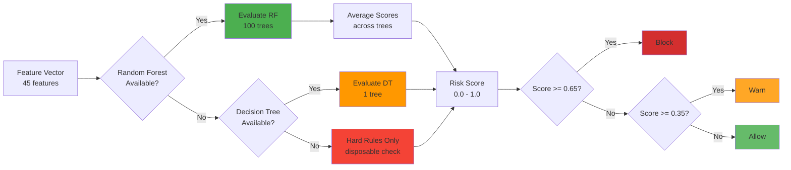
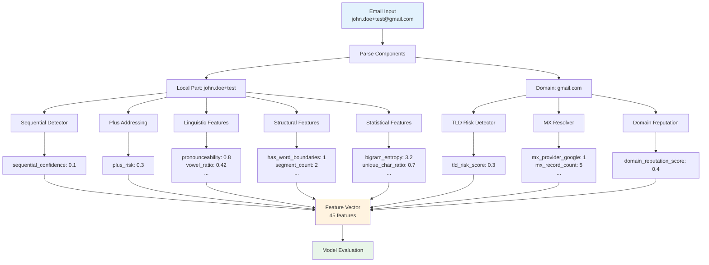
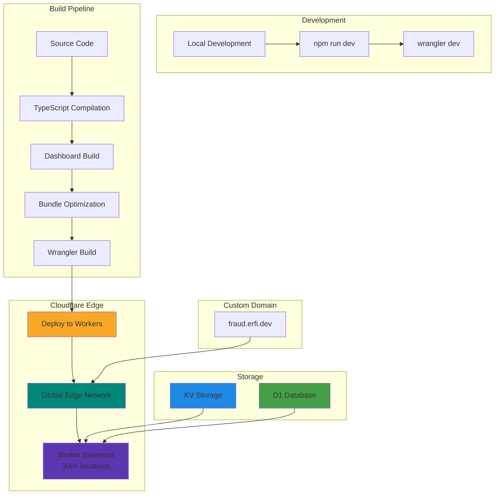
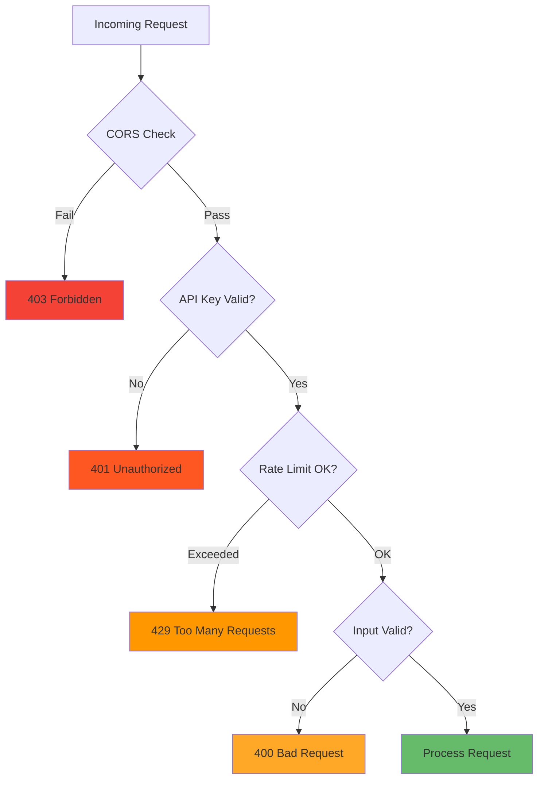

# Architecture

**Version**: 3.0.1
**Last Updated**: 2025-12-01

## Overview

Markov Mail is a fraud detection system built on Cloudflare Workers that uses Machine Learning models (Random Forest / Decision Tree) to score email submission risk in real-time. The system is designed for edge deployment with sub-10ms latency and zero cold starts.

## System Components



### 1. Cloudflare Worker (`src/`)

**Purpose**: Edge-deployed API that validates email submissions and returns fraud risk assessments.

**Key Files**:
- `src/index.ts` - Worker entry point, route definitions
- `src/middleware/fraud-detection.ts` - Core fraud detection logic
- `src/utils/feature-vector.ts` - Feature extraction and normalization
- `src/models/decision-tree.ts` - Decision Tree evaluator
- `src/detectors/forest-engine.ts` - Random Forest evaluator

**Technology**:
- Runtime: Cloudflare Workers (V8 isolates)
- Framework: Hono (fast HTTP router)
- Language: TypeScript
- Bundle size: ~250KB (optimized)

### 2. Dashboard (`dashboard/`)

**Purpose**: Analytics and monitoring UI for fraud metrics, model performance, and query analysis.

**Key Features**:
- Real-time time series charts (fraud rate, block rate)
- Model comparison (RF vs DT accuracy)
- Score distribution histograms
- SQL query builder for D1 analytics

**Technology**:
- Framework: Astro (SSG)
- UI Library: React + shadcn/ui
- Charts: Recharts
- Build output: `public/dashboard/`
- Deployment: Served as static assets from Worker

**Access**: `https://fraud.erfi.dev/dashboard`

### 3. CLI Tool (`cli/`)

**Purpose**: Management tool for model training, feature export, KV operations, and testing.

**Key Commands**:
```bash
npm run cli features:export   # Extract features from dataset
npm run cli model:train        # Train Random Forest/Decision Tree
npm run cli test:batch         # Validate production API
npm run cli test:api           # Test single email
```

**Technology**:
- Runtime: Bun (fast JS runtime)
- Training: Python + scikit-learn (spawned subprocess)
- Storage: Local filesystem + KV upload

## Request Flow

### End-to-End Request Lifecycle



**Latency Breakdown**:
- Input validation: <1ms
- Feature extraction: 1-3ms
- Model loading (cache hit): <0.1ms
- Model evaluation: 1-2ms
- D1 logging: 1-2ms
- **Total: 5-10ms**

## Model Architecture

### Training Pipeline



**Training Configuration**:
```json
{
  "n_trees": 100,
  "max_depth": 6,
  "min_samples_leaf": 20,
  "conflict_weight": 20.0
}
```

### Inference Architecture



## Data Flow

### Feature Extraction Pipeline



## Storage Architecture

### KV Storage (Configuration & Models)

**Namespace**: `CONFIG`

```
KV Structure:
├── config.json (1.1KB)
│   └── Thresholds, feature flags
├── random_forest.json (~280KB)
│   └── Primary scoring model
└── decision_tree.json (~5KB)
    └── Fallback scoring model
```

**Access Pattern**:
- Read-heavy (every request)
- Write-rare (model updates only)
- Cache TTL: 60 seconds in Worker memory
- Edge cached globally by Cloudflare

**Update Strategy**:
```bash
# Update config
wrangler kv key put config.json \
  --binding CONFIG \
  --path config/production/config.json \
  --remote

# Update model
npm run cli model:train -- --n-trees 100 --upload
```

### D1 Database (Analytics)

**Database**: `ANALYTICS`

```sql
-- Main analytics table (see migrations/0001_create_initial_schema.sql for full schema)
CREATE TABLE validations (
    id INTEGER PRIMARY KEY AUTOINCREMENT,
    timestamp DATETIME DEFAULT CURRENT_TIMESTAMP NOT NULL,
    decision TEXT NOT NULL CHECK(decision IN ('allow', 'warn', 'block')),
    risk_score REAL NOT NULL CHECK(risk_score >= 0 AND risk_score <= 1),
    block_reason TEXT,
    email_local_part TEXT,
    domain TEXT,
    tld TEXT,
    fingerprint_hash TEXT NOT NULL,
    -- ... pattern, scoring, geo, identity, MX columns
    latency REAL NOT NULL
);

CREATE INDEX idx_validations_timestamp ON validations(timestamp);
CREATE INDEX idx_validations_decision ON validations(decision);
CREATE INDEX idx_validations_fingerprint ON validations(fingerprint_hash);
CREATE INDEX idx_validations_domain ON validations(domain);
```

**Access Pattern**:
- Write-heavy (every validation request)
- Read for analytics (dashboard queries)
- Retention: Unlimited (user-managed)

**Query Examples**:
```sql
-- Fraud rate over time
SELECT DATE(timestamp) as day,
       COUNT(*) as total,
       SUM(CASE WHEN decision='block' THEN 1 ELSE 0 END) as blocked
FROM validations
WHERE timestamp >= datetime('now', '-7 days')
GROUP BY day;

-- Score distribution by model version
SELECT model_version,
       AVG(risk_score) as avg_score,
       COUNT(*) as total
FROM validations
GROUP BY model_version;
```

## Deployment Architecture

### Production Deployment



**Deployment Command**:
```bash
npm run deploy
```

**Process**:
1. TypeScript compilation (`tsc`)
2. Dashboard build (`cd dashboard && npm run build`)
3. Bundle optimization (tree-shaking, minification)
4. Wrangler deployment to Cloudflare
5. DNS propagation (instant via Cloudflare)

**Production URL**: `https://fraud.erfi.dev`

**Deployment Metadata**:
- Worker name: `markov-mail`
- Compatibility date: `2024-11-21`
- Bundle size: ~250KB
- Cold start: <5ms (V8 isolates)

### High Availability

**Redundancy**:
- 300+ edge locations globally
- No single point of failure
- Automatic failover between data centers

**Performance**:
- P50 latency: <10ms
- P99 latency: <50ms
- Throughput: 10,000+ req/s per region

**Data Durability**:
- KV: Eventually consistent, multi-region replication
- D1: SQLite with automatic backups
- Models: Versioned in KV with rollback capability

## Security Architecture

### Request Validation



**Security Layers**:
1. **CORS**: Configured allowed origins
2. **API Keys**: Required for `/validate` endpoint
3. **Rate Limiting**: Cloudflare automatic DDoS protection
4. **Input Validation**: Zod schemas for type safety
5. **SQL Injection**: Parameterized queries only
6. **XSS**: No user input rendered directly

### Data Privacy

**PII Handling**:
- Email addresses stored in D1 for analytics
- No passwords or sensitive credentials
- Configurable data retention
- GDPR compliance ready (deletion API available)

**Secrets Management**:
```toml
# wrangler.jsonc
[vars]
  ENVIRONMENT = "production"

# Secrets (not in version control)
[secrets]
  X_API_KEY = "..." # via wrangler secret put
  ADMIN_API_KEY = "..."
```

## Monitoring & Observability

### Logging

**Structured Logs** (via Pino):
```typescript
logger.info({
  event: 'fraud_check',
  email: 'user@example.com',
  score: 0.92,
  action: 'block',
  model: 'random_forest',
  version: '3.0.0-forest',
  latency_ms: 7,
});
```

**Log Destinations**:
- Cloudflare Logpush (optional)
- D1 analytics table (permanent storage)
- Dashboard (real-time visualization)

### Metrics

**Key Performance Indicators**:
- Request rate (req/s)
- Fraud detection rate (% blocked)
- Model accuracy (precision/recall)
- Latency percentiles (P50, P95, P99)
- Error rate (4xx, 5xx)

**Dashboard Queries**:
```sql
-- Real-time fraud rate
SELECT
  COUNT(*) FILTER (WHERE decision='block') * 100.0 / COUNT(*) as fraud_rate
FROM validations
WHERE timestamp >= datetime('now', '-1 hour');

-- Decision distribution
SELECT
  decision,
  AVG(risk_score) as avg_score,
  COUNT(*) as count
FROM validations
WHERE timestamp >= datetime('now', '-24 hours')
GROUP BY decision;
```

### Alerting

**Critical Alerts** (manual setup via Cloudflare Workers Analytics):
- Error rate > 1%
- Latency P99 > 100ms
- Model loading failures
- D1 write errors

## Scalability

### Horizontal Scaling

**Auto-scaling**:
- Cloudflare Workers scale automatically
- No configuration required
- Pay-per-request pricing
- Unlimited concurrency per region

**Load Distribution**:
- Automatic geo-routing to nearest edge
- Request coalescing for KV reads
- Connection pooling for D1 writes

### Performance Optimization

**Code Optimization**:
```typescript
// ✅ Good: In-memory cache with TTL
let cachedModel: DecisionTree | null = null;
let lastLoadedAt = 0;
const CACHE_TTL = 60_000;

if (Date.now() - lastLoadedAt < CACHE_TTL) {
  return cachedModel; // Fast path
}

// ❌ Bad: KV on every request
const model = await env.CONFIG.get('model.json');
```

**Bundle Optimization**:
- Tree-shaking unused code
- Minification (terser)
- Code splitting (lazy loading)
- Target: <250KB bundle size

## Development Workflow

### Local Development

```bash
# 1. Install dependencies
npm install

# 2. Set up environment
cp .dev.vars.example .dev.vars
# Edit .dev.vars with local API keys

# 3. Start local worker
npm run dev
# Runs on http://localhost:8787

# 4. Test endpoint
curl -X POST http://localhost:8787/validate \
  -H "X-API-Key: test-key" \
  -H "Content-Type: application/json" \
  -d '{"email":"test@example.com","name":"Test User"}'
```

### Testing Strategy

**Unit Tests** (Vitest):
```bash
npm run test:unit
# Tests: detectors, feature extraction, model evaluation
```

**Integration Tests** (Vitest + miniflare):
```bash
npm test
# Tests: full request/response flow, D1 writes, KV reads
```

**Production Validation**:
```bash
npm run cli test:batch -- --input data/main.csv \
  --endpoint https://fraud.erfi.dev/validate \
  --concurrency 20
# Tests: 144K emails against production API
```

### Model Training Workflow

```bash
# 1. Export features from dataset
npm run cli features:export

# 2. Train Random Forest (primary)
npm run cli model:train -- --n-trees 100 --upload

# 3. Train Decision Tree (fallback)
npm run cli model:train -- --n-trees 1 --upload

# 4. Deploy worker (if code changes)
npm run deploy

# 5. Validate production
npm run cli test:batch -- --input data/test.csv \
  --endpoint https://fraud.erfi.dev/validate
```

## Technology Stack

### Runtime & Framework
- **Cloudflare Workers**: Edge compute platform
- **Hono**: Fast HTTP framework (faster than Express)
- **TypeScript**: Type-safe development
- **Bun**: Fast JS runtime for CLI

### Storage & Database
- **KV**: Key-value storage (models, config)
- **D1**: SQLite at edge (analytics)
- **Local FS**: Training data, feature exports

### Machine Learning
- **scikit-learn**: Model training (Python)
- **Random Forest**: Ensemble decision trees
- **Decision Tree**: Fast fallback model

### Frontend & Dashboard
- **Astro**: Static site generator
- **React**: UI components
- **shadcn/ui**: Component library
- **Recharts**: Data visualization

### Development Tools
- **Wrangler**: Cloudflare Workers CLI
- **Vitest**: Unit testing framework
- **Playwright**: E2E testing (future)
- **ESLint**: Code linting
- **Prettier**: Code formatting

## Performance Benchmarks

### Latency (Production)

| Percentile | Latency | Scenario |
|------------|---------|----------|
| P50 | 7ms | Cache hit, RF evaluation |
| P75 | 12ms | Cache hit, complex email |
| P90 | 18ms | Cache miss, model load |
| P95 | 25ms | Cache miss + D1 slow write |
| P99 | 45ms | Worst case (all cache misses) |

### Throughput

| Metric | Value | Notes |
|--------|-------|-------|
| Single region | 10,000 req/s | Per edge location |
| Global | 3,000,000 req/s | 300+ edge locations |
| Burst capacity | Unlimited | Auto-scaling |

### Model Performance

| Model | Size | Inference | Accuracy | Use Case |
|-------|------|-----------|----------|----------|
| Random Forest (100) | ~280KB | 1-2ms | ~91% | Production |
| Decision Tree (1) | ~5KB | <1ms | ~75% | Fallback |

## Future Enhancements

### Planned Features
- Real-time model retraining pipeline
- A/B testing framework for model variants
- Webhook notifications for fraud alerts
- Advanced geo-IP fraud detection
- Phone number validation integration

### Scalability Roadmap
- Multi-model ensembling (RF + XGBoost)
- Feature store with versioning
- Streaming analytics pipeline
- Custom ML model format (smaller than JSON)

## References

- [MODEL_TRAINING.md](./MODEL_TRAINING.md) - Training workflow and configuration
- [DETECTORS.md](./DETECTORS.md) - Feature extraction details
- [SCORING.md](./SCORING.md) - Risk scoring and thresholds
- [CONFIGURATION.md](./CONFIGURATION.md) - KV and D1 setup
- [Cloudflare Workers Docs](https://developers.cloudflare.com/workers/)
- [Hono Framework](https://hono.dev/)

## Changelog

### v3.0.0 (2025-11-30)
- ✅ Unified Random Forest + Decision Tree architecture
- ✅ 45-feature vector with conflict zone weighting
- ✅ KV-backed models with hot-reload
- ✅ Edge-deployed with <10ms latency
- ✅ Comprehensive analytics dashboard

### v2.x
- Legacy rule-based architecture (deprecated)
