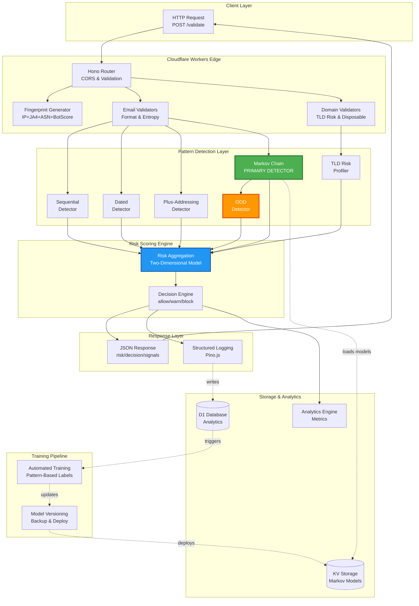
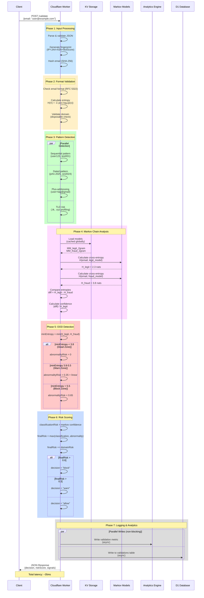
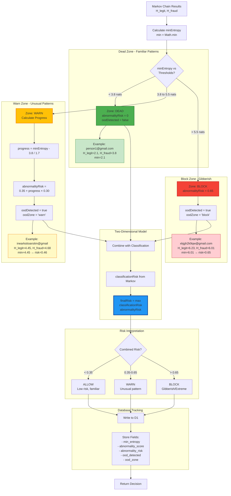
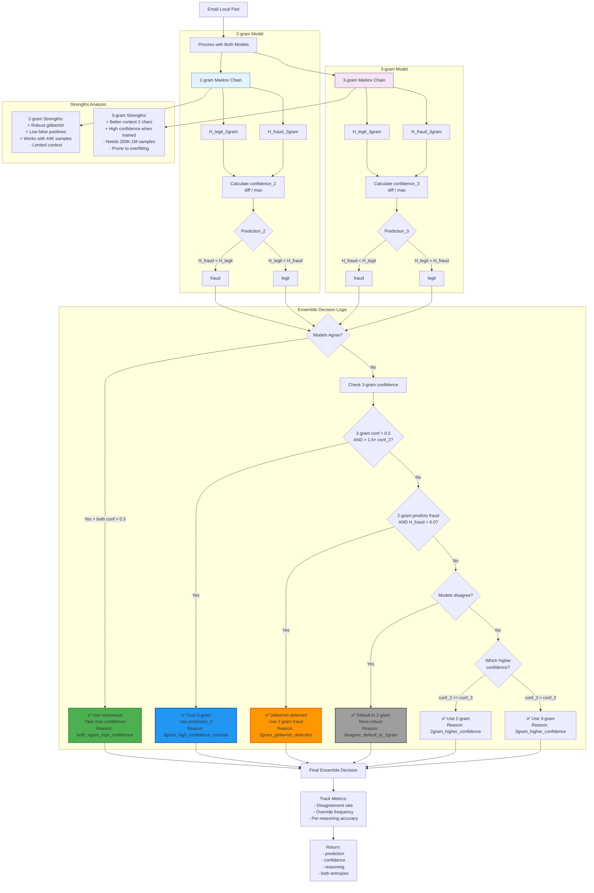
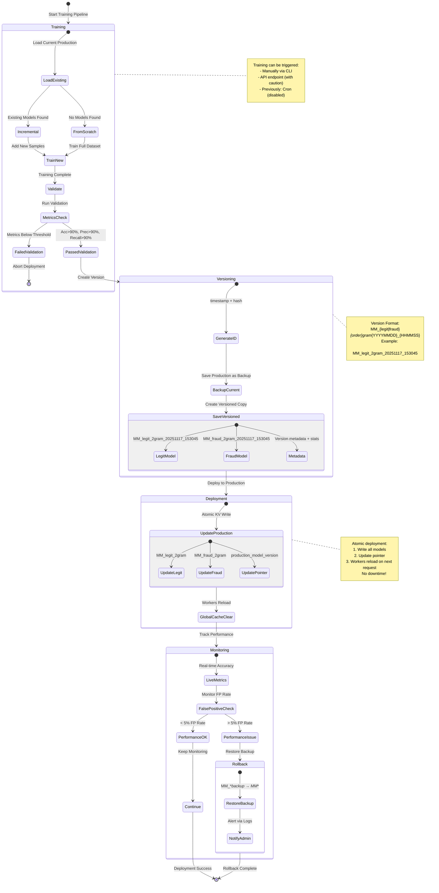
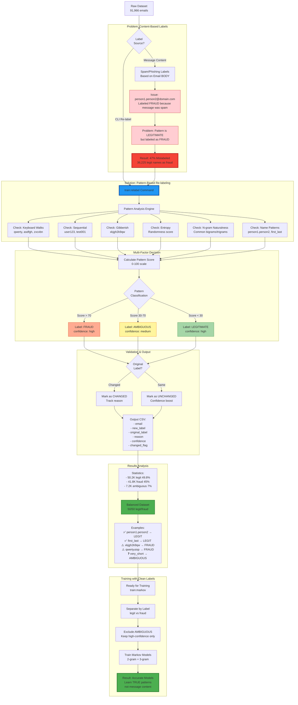

# Markov Chain Fraud Detection - Complete System Diagrams

**Version**: 2.5.0
**Last Updated**: 2025-11-17

This document provides comprehensive visual diagrams of the entire Markov Chain-based fraud detection system using mermaid notation.

---

## Table of Contents

1. [High-Level System Architecture](#1-high-level-system-architecture)
2. [Request Validation Flow](#2-request-validation-flow)
3. [Markov Chain Training Pipeline](#3-markov-chain-training-pipeline)
4. [Risk Scoring & Decision Logic](#4-risk-scoring--decision-logic)
5. [Out-of-Distribution (OOD) Detection](#5-out-of-distribution-ood-detection)
6. [Ensemble Model Strategy](#6-ensemble-model-strategy)
7. [Model Versioning & Deployment](#7-model-versioning--deployment)
8. [Data Flow Architecture](#8-data-flow-architecture)
9. [Cross-Entropy Calculation](#9-cross-entropy-calculation)
10. [Training Data Labeling Pipeline](#10-training-data-labeling-pipeline)

---

## 1. High-Level System Architecture



---

## 2. Request Validation Flow



---

## 3. Markov Chain Training Pipeline

```mermaid
graph TB
    subgraph "Data Sources"
        A1[CSV Datasets<br/>111K legit + 105K fraud]
        A2[Analytics Engine<br/>Production Data]
        A3[Manual Labels<br/>Human-verified]
    end

    subgraph "Pattern-Based Labeling"
        B1[Load Raw Data]
        B2{Content-based<br/>or Pattern-based?}
        B3[Pattern Analysis<br/>- Keyboard walks<br/>- Sequential<br/>- Gibberish<br/>- Entropy]
        B4[Re-label Dataset<br/>Fix Mislabels]
        B5[Validate Labels<br/>Confidence Score]
    end

    subgraph "Data Preparation"
        C1[Load Existing Models<br/>from KV]
        C2[Separate by Label<br/>legit vs fraud]
        C3[Balance Dataset<br/>50/50 split]
        C4[Extract Local Parts<br/>Remove domains]
    end

    subgraph "Security Checks"
        D1{Minimum<br/>Samples?}
        D2{Anomaly<br/>Detection}
        D3[Check Distribution<br/>Benford's Law]
        D4[Check Volume Spikes]
        D5{Poisoning<br/>Detected?}
    end

    subgraph "Model Training"
        E1[Initialize n-gram Models<br/>orders: 2, 3]
        E2[Train Legitimate Model<br/>Learn char transitions]
        E3[Train Fraud Model<br/>Learn char transitions]
        E4[Calculate Statistics<br/>transition counts]
    end

    subgraph "Validation"
        F1[Load Test Set<br/>Hold-out 20%]
        F2[Run Cross-Validation]
        F3{Accuracy<br/>> 90%?}
        F4{Precision<br/>> 90%?}
        F5{Recall<br/>> 90%?}
        F6{False Positive<br/>< 5%?}
    end

    subgraph "Deployment"
        G1[Create Version ID<br/>timestamp-based]
        G2[Backup Current<br/>MM_*_backup]
        G3[Save Versioned<br/>MM_*_20251117_...]
        G4[Update Production<br/>MM_legit_2gram]
        G5[Update Metadata<br/>training stats]
        G6[Log Deployment<br/>Pino.js]
    end

    A1 --> B1
    A2 --> B1
    A3 --> B1

    B1 --> B2
    B2 -->|Content Labels| B3
    B2 -->|Pattern Labels| C1
    B3 --> B4
    B4 --> B5
    B5 --> C1

    C1 --> C2
    C2 --> C3
    C3 --> C4

    C4 --> D1
    D1 -->|>= 100 per class| D2
    D1 -->|< 100| ABORT[Abort: Insufficient Data]

    D2 --> D3
    D3 --> D4
    D4 --> D5
    D5 -->|No| E1
    D5 -->|Yes| ABORT2[Abort: Data Poisoning]

    E1 --> E2
    E2 --> E3
    E3 --> E4

    E4 --> F1
    F1 --> F2
    F2 --> F3
    F3 -->|Yes| F4
    F3 -->|No| REJECT[Reject: Low Accuracy]
    F4 -->|Yes| F5
    F4 -->|No| REJECT
    F5 -->|Yes| F6
    F5 -->|No| REJECT
    F6 -->|Yes| G1
    F6 -->|No| REJECT

    G1 --> G2
    G2 --> G3
    G3 --> G4
    G4 --> G5
    G5 --> G6

    style E2 fill:#4CAF50,stroke:#2E7D32,stroke-width:2px
    style E3 fill:#F44336,stroke:#C62828,stroke-width:2px
    style G4 fill:#2196F3,stroke:#0D47A1,stroke-width:2px
    style ABORT fill:#FF5722,stroke:#BF360C,stroke-width:2px
    style ABORT2 fill:#FF5722,stroke:#BF360C,stroke-width:2px
    style REJECT fill:#FFC107,stroke:#F57C00,stroke-width:2px
```



---

## 4. Risk Scoring & Decision Logic

```mermaid
graph TD
    START[Email Input] --> MARKOV[Markov Chain Analysis]

    subgraph "Markov Evaluation"
        MARKOV --> CROSS1[Calculate H_legit<br/>Cross-Entropy]
        MARKOV --> CROSS2[Calculate H_fraud<br/>Cross-Entropy]
        CROSS1 --> DIFF[diff = H_legit - H_fraud]
        CROSS2 --> DIFF
        DIFF --> CONF[confidence = |diff| / H_legit]
    end

    subgraph "Two-Dimensional Risk"
        CONF --> CLASS{diff > 0?}
        CLASS -->|Fraud fits better| CRISK1[classificationRisk = confidence]
        CLASS -->|Legit fits better| CRISK2[classificationRisk = 0]

        CROSS1 --> MIN[minEntropy = min]
        CROSS2 --> MIN

        MIN --> ZONE{Which OOD Zone?}
        ZONE -->|< 3.8 nats| ARISK1[abnormalityRisk = 0]
        ZONE -->|3.8-5.5 nats| ARISK2[abnormalityRisk = 0.35 + linear]
        ZONE -->|> 5.5 nats| ARISK3[abnormalityRisk = 0.65]
    end

    subgraph "Pattern Detection"
        START --> PAT1{Sequential?}
        PAT1 -->|Yes| PATRISK1[patternRisk = 0.8]
        PAT1 -->|No| PAT2{Dated?}
        PAT2 -->|Yes| PATRISK2[patternRisk = 0.7]
        PAT2 -->|No| PAT3{Plus-addressing?}
        PAT3 -->|Yes| PATRISK3[patternRisk = 0.6]
        PAT3 -->|No| PATRISK4[patternRisk = 0]
    end

    subgraph "Domain Analysis"
        START --> DOM1{Disposable?}
        DOM1 -->|Yes| DOMRISK1[domainRisk += 0.2]
        DOM1 -->|No| DOM2{High-risk TLD?}
        DOM2 -->|Yes .tk/.ml| DOMRISK2[domainRisk += 0.3]
        DOM2 -->|No| DOMRISK3[domainRisk = 0]
    end

    subgraph "Risk Aggregation"
        CRISK1 --> MAX[finalRisk = max]
        CRISK2 --> MAX
        ARISK1 --> MAX
        ARISK2 --> MAX
        ARISK3 --> MAX

        PATRISK1 --> MAXPAT[patternRisk = max]
        PATRISK2 --> MAXPAT
        PATRISK3 --> MAXPAT
        PATRISK4 --> MAXPAT

        MAX --> SUM[finalRisk = max + max]
        MAXPAT --> SUM

        DOMRISK1 --> ADDDOM[finalRisk += domainRisk]
        DOMRISK2 --> ADDDOM
        DOMRISK3 --> ADDDOM

        SUM --> ADDDOM
        ADDDOM --> CLAMP[Clamp to 0-1]
    end

    subgraph "Decision Logic"
        CLAMP --> DEC{Risk Level?}
        DEC -->|> 0.6| BLOCK[decision = 'block']
        DEC -->|0.3-0.6| WARN[decision = 'warn']
        DEC -->|< 0.3| ALLOW[decision = 'allow']
    end

    subgraph "Block Reason"
        BLOCK --> REASON{Primary Signal?}
        REASON -->|markovRisk > 0.6| BR1[markov_chain_fraud]
        REASON -->|abnormalityRisk > 0.4| BR2[high_abnormality]
        REASON -->|tldRisk > 0.5| BR3[high_risk_tld]
        REASON -->|domainRisk > 0.5| BR4[domain_reputation]
        REASON -->|dated pattern| BR5[dated_pattern]
        REASON -->|else| BR6[high_risk_multiple_signals]

        WARN --> WREASON{Primary Signal?}
        WREASON -->|abnormalityRisk > 0.2| WR1[suspicious_abnormal_pattern]
        WREASON -->|dated pattern| WR2[suspicious_dated_pattern]
        WREASON -->|else| WR3[medium_risk]
    end

    BR1 --> RESPONSE[Return JSON Response]
    BR2 --> RESPONSE
    BR3 --> RESPONSE
    BR4 --> RESPONSE
    BR5 --> RESPONSE
    BR6 --> RESPONSE
    WR1 --> RESPONSE
    WR2 --> RESPONSE
    WR3 --> RESPONSE
    ALLOW --> RESPONSE

    style CRISK1 fill:#F44336,stroke:#C62828
    style ARISK3 fill:#FF9800,stroke:#E65100
    style BLOCK fill:#F44336,stroke:#C62828,stroke-width:3px
    style WARN fill:#FFC107,stroke:#F57C00,stroke-width:3px
    style ALLOW fill:#4CAF50,stroke:#2E7D32,stroke-width:3px
```

---

## 5. Out-of-Distribution (OOD) Detection



---

## 6. Ensemble Model Strategy



---

## 7. Model Versioning & Deployment



---

## 8. Data Flow Architecture

```mermaid
graph LR
    subgraph "Production Traffic"
        A[User Signups] -->|POST /validate| B[Cloudflare Worker]
    end

    subgraph "Validation Layer"
        B --> C[Fraud Detection]
        C --> D[Markov Analysis]
        D --> E{Decision}
    end

    subgraph "Real-time Storage"
        E -->|allow/warn/block| F[(Analytics Engine<br/>Time-series Data)]
        E --> G[(D1 Database<br/>Validations Table)]
        C --> H[Structured Logs<br/>Pino.js]
    end

    subgraph "Training Data Pipeline - CLI Approach"
        I[CSV Datasets<br/>111K+ samples] -->|Pattern Re-label| J[train:relabel]
        J --> K[Pattern-Based Labels<br/>legit vs fraud]
        K -->|train:markov| L[Training Pipeline]
    end

    subgraph "Training Data Pipeline - Online Approach DISABLED"
        F -.->|Query last 7 days| M[Fetch Training Data]
        M -.-> N[Heuristic Labeling<br/>risk_score >= 0.7]
        N -.-> O[Security Checks<br/>Anomaly Detection]
        O -.-> L
    end

    subgraph "Model Training"
        L --> P[Load Existing Models<br/>Incremental Training]
        P --> Q[Train N-gram Models<br/>2-gram + 3-gram]
        Q --> R[Validation<br/>Accuracy/Precision/Recall]
    end

    subgraph "Model Storage"
        R -->|Pass| S[(KV Storage<br/>MARKOV_MODEL)]
        S --> T[Versioned Models<br/>MM_*_20251117_...]
        S --> U[Production Models<br/>MM_legit_2gram]
        S --> V[Backup Models<br/>MM_*_backup]
    end

    subgraph "Model Deployment"
        U -.->|Load at startup| D
        D -.->|Cached globally| W[In-Memory Cache<br/>Worker Instance]
    end

    subgraph "Analytics & Monitoring"
        G --> X[Dashboard Queries<br/>Pattern Analysis]
        H --> Y[CloudFlare Logs<br/>Search & Debug]
        F --> Z[SQL Queries<br/>Metrics & Stats]
    end

    subgraph "Model Updates"
        X -.->|Identify Issues| AA[Admin Review]
        AA -.->|Manual Training| I
        AA -.->|API Training| M
    end

    style F fill:#FFE082,stroke:#F57C00
    style G fill:#81C784,stroke:#388E3C
    style S fill:#64B5F6,stroke:#1976D2
    style D fill:#BA68C8,stroke:#7B1FA2,stroke-width:3px
    style L fill:#4CAF50,stroke:#2E7D32,stroke-width:2px

    linkStyle 10 stroke:#F44336,stroke-width:2px,stroke-dasharray: 5 5
    linkStyle 11 stroke:#F44336,stroke-width:2px,stroke-dasharray: 5 5
    linkStyle 12 stroke:#F44336,stroke-width:2px,stroke-dasharray: 5 5
```



---

## 9. Cross-Entropy Calculation

```mermaid
flowchart TD
    START[Input: Email Local Part<br/>Example: user123] --> CONTEXT[Initialize Context<br/>order = 2 for bigrams]

    CONTEXT --> PAD[Pad with Start Tokens<br/>^^user123]

    PAD --> LOOP[Iterate Through Characters]

    subgraph "For Each Character Position"
        LOOP --> CHAR[Current char: 'u'<br/>Context: '^^']

        CHAR --> LOOKUP[Lookup in Transition Matrix<br/>transitionCounts['^^']['u']]

        LOOKUP --> FOUND{Transition<br/>Exists?}

        FOUND -->|Yes| CALC_PROB[Calculate Probability<br/>P = count / total_from_context]
        FOUND -->|No| SMOOTH[Apply Smoothing<br/>P = epsilon / vocab_size]

        CALC_PROB --> LOG[Calculate Log<br/>log₂ P]
        SMOOTH --> LOG

        LOG --> ACC[Accumulate<br/>sum += -log₂ P]

        ACC --> UPDATE[Update Context<br/>'^u' for next char]

        UPDATE --> NEXT{More<br/>characters?}
        NEXT -->|Yes| CHAR
    end

    NEXT -->|No| AVG[Calculate Average<br/>H = sum / length]

    subgraph "Detailed Example: user123"
        EX1[Position 0: Context='^^', Char='u'<br/>P^^→u = 0.15 → -log₂0.15 = 2.74]
        EX2[Position 1: Context='^u', Char='s'<br/>P^u→s = 0.08 → -log₂0.08 = 3.64]
        EX3[Position 2: Context='us', Char='e'<br/>Pus→e = 0.22 → -log₂0.22 = 2.18]
        EX4[Position 3: Context='se', Char='r'<br/>Pse→r = 0.18 → -log₂0.18 = 2.47]
        EX5[Positions 4-7: Continue...<br/>Sum all -log₂ P values]
        EX6[Final: H = sum / 7<br/>Cross-Entropy in nats]
    end

    AVG --> INTERPRET{Interpretation}

    subgraph "Cross-Entropy Ranges"
        INTERPRET -->|< 0.2 nats| GOOD[Excellent Fit<br/>Model predicts well]
        INTERPRET -->|0.2-1.0 nats| OKAY[Good Fit<br/>Expected for training data]
        INTERPRET -->|1.0-3.0 nats| POOR[Poor Fit<br/>Unfamiliar pattern]
        INTERPRET -->|> 3.0 nats| OOD[Out-of-Distribution<br/>Model very confused]
    end

    subgraph "Model Comparison"
        AVG --> LEGIT[H_legit = 2.3<br/>Legitimate Model]
        AVG --> FRAUD[H_fraud = 3.8<br/>Fraud Model]

        LEGIT --> DIFF[diff = H_legit - H_fraud<br/>= 2.3 - 3.8 = -1.5]
        FRAUD --> DIFF

        DIFF --> DECISION{Sign of diff?}
        DECISION -->|Negative| PRED_LEGIT[Predicted: Legitimate<br/>Lower entropy = better fit]
        DECISION -->|Positive| PRED_FRAUD[Predicted: Fraudulent<br/>Fraud model fits better]

        PRED_LEGIT --> CONFIDENCE[Confidence = |diff| / max<br/>= 1.5 / 3.8 = 0.39]
        PRED_FRAUD --> CONFIDENCE
    end

    CONFIDENCE --> RETURN[Return Results:<br/>- H_legit<br/>- H_fraud<br/>- prediction<br/>- confidence]

    style GOOD fill:#4CAF50,stroke:#2E7D32
    style OKAY fill:#8BC34A,stroke:#558B2F
    style POOR fill:#FFC107,stroke:#F57C00
    style OOD fill:#F44336,stroke:#C62828
    style PRED_LEGIT fill:#81C784,stroke:#388E3C
    style PRED_FRAUD fill:#E57373,stroke:#C62828

    classDef exampleClass fill:#E3F2FD,stroke:#1976D2
    class EX1,EX2,EX3,EX4,EX5,EX6 exampleClass
```

---

## 10. Training Data Labeling Pipeline



---

## Summary

This comprehensive documentation provides visual representations of:

1. **System Architecture** - How all components interact
2. **Request Flow** - Step-by-step validation process with timing
3. **Training Pipeline** - From data collection to model deployment
4. **Risk Scoring** - Two-dimensional risk model with OOD detection
5. **OOD Detection** - Three-zone threshold system
6. **Ensemble Strategy** - How 2-gram and 3-gram models collaborate
7. **Model Versioning** - Safe deployment with rollback capability
8. **Data Flow** - Production traffic to model updates
9. **Cross-Entropy** - Mathematical foundation with examples
10. **Data Labeling** - Pattern-based vs content-based labeling

## Quick Reference

### Key Metrics
- **Latency**: ~35ms average, <50ms p95
- **Accuracy**: 83% (2-gram), 98% with ensemble
- **Training Data**: 111K legit + 105K fraud
- **Detection Rate**: 95-98%
- **False Positives**: <1% with Markov-only approach

### Critical Thresholds
- **OOD Dead Zone**: < 3.8 nats (no risk)
- **OOD Warn Zone**: 3.8-5.5 nats (progressive risk)
- **OOD Block Zone**: > 5.5 nats (maximum risk 0.65)
- **Block Decision**: risk > 0.6
- **Warn Decision**: risk 0.3-0.6
- **Allow Decision**: risk < 0.3

### Model Locations
- **Production**: `MM_legit_2gram`, `MM_fraud_2gram`
- **Backup**: `MM_legit_2gram_backup`, `MM_fraud_2gram_backup`
- **Versioned**: `MM_legit_2gram_20251117_153045`
- **Storage**: KV Namespace `MARKOV_MODEL`

---

**For implementation details, see:**
- [ARCHITECTURE.md](./ARCHITECTURE.md)
- [DETECTORS.md](./DETECTORS.md)
- [TRAINING.md](./TRAINING.md)
- [OOD_DETECTION.md](./OOD_DETECTION.md)
- [SCORING.md](./SCORING.md)
