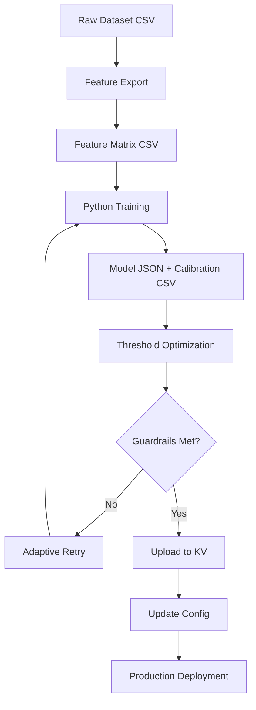

# Training Pipeline Guide

Complete reference for the automated training pipeline system.

## Overview

The pipeline automates the entire model training workflow from raw dataset through feature engineering, model training, calibration, threshold optimization, and deployment to Cloudflare KV.

## Quick Start

```bash
# Full automated training pipeline
npm run pipeline -- \
  --dataset data/main-final.csv \
  --export-modes full \
  --search '[{"label":"base","nTrees":100,"maxDepth":6,"noSplit":true}]' \
  --min-recall 0.90 \
  --max-fpr 0.10 \
  --max-fnr 0.10 \
  --upload-model \
  --apply-thresholds \
  --sync-config
```

## Pipeline Architecture



## Command Reference

### Basic Pipeline

```bash
npm run pipeline -- \
  --dataset <path> \
  --export-modes <mode> \
  --search '<config>' \
  [options]
```

### Core Parameters

| Parameter | Description | Example |
|-----------|-------------|---------|
| `--dataset` | Path to CSV with email/label columns | `data/main-final.csv` |
| `--label-column` | Name of label column | `label` (default) |
| `--export-modes` | Feature export mode: `full`, `no-mx`, `quick` | `full` |
| `--search` | JSON array of training configurations | See below |

### Search Configuration

The `--search` parameter accepts a JSON array of training configs:

```json
[
  {
    "label": "baseline",
    "nTrees": 100,
    "maxDepth": 6,
    "conflictWeight": 20.0,
    "skipMx": false,
    "noSplit": true,
    "featureMode": "full"
  }
]
```

**Configuration Fields:**
- `label`: Descriptive name for this run
- `nTrees`: Number of trees (1=decision tree, 10+=random forest)
- `maxDepth`: Maximum tree depth (default: 6)
- `min-samples-leaf`: Minimum samples per leaf (default: 20)
- `conflictWeight`: Sample weight for high-entropy conflict zone (default: 20.0)
- `skipMx`: Skip MX lookups for faster iteration (default: false)
- `noSplit`: Train on 100% of data vs 80/20 split (default: false, use `true` for production)
- `featureMode`: `full`, `no-mx`, or `quick`

### Adaptive Search

Enable automatic hyperparameter tuning with retry logic:

```bash
--adaptive '{
  "maxTrees": 350,
  "maxDepth": 10,
  "maxConflictWeight": 70,
  "nTreesStep": 25,
  "conflictStep": 5
}'
```

The pipeline will automatically retry with adjusted parameters if guardrails fail.

### Guardrail Constraints

Set minimum performance requirements:

```bash
--min-recall 0.90        # Minimum fraud detection rate (90%)
--max-fpr 0.10           # Maximum false positive rate (10%)
--max-fnr 0.10           # Maximum false negative rate (10%)
--min-threshold-gap 0.01 # Minimum gap between warn/block thresholds
```

### Calibration Retries

Configure threshold optimization retries:

```bash
--calibration-retries 2           # Number of retry attempts
--retry-threshold-step 0.02       # Step size for threshold adjustment
```

### Deployment Options

```bash
--upload-model        # Upload model JSON to KV
--apply-thresholds    # Update config with optimized thresholds
--sync-config         # Sync full config to KV
--dry-run             # Test without uploading
--binding CONFIG      # KV namespace binding (default: CONFIG)
```

### Resume From Previous Run

```bash
npm run pipeline -- \
  --resume tmp/pipeline-runs/2025-12-01-10-20-24 \
  --min-recall 0.92 \
  --calibration-retries 3
```

## Complete Examples

### Production Training (Recommended)

Train on 100% of data with strict guardrails:

```bash
npm run pipeline -- \
  --dataset data/main-final.csv \
  --export-modes full \
  --search '[{
    "label":"prod-100",
    "nTrees":100,
    "maxDepth":6,
    "noSplit":true,
    "featureMode":"full"
  }]' \
  --min-recall 0.90 \
  --max-fpr 0.10 \
  --max-fnr 0.10 \
  --upload-model \
  --apply-thresholds \
  --sync-config
```

### Development Iteration

Fast training with 80/20 split for testing:

```bash
npm run pipeline -- \
  --dataset data/main-final.csv \
  --export-modes no-mx \
  --search '[{
    "label":"dev-test",
    "nTrees":10,
    "maxDepth":5,
    "skipMx":true,
    "noSplit":false
  }]' \
  --min-recall 0.85 \
  --max-fpr 0.15
```

### Adaptive High-Performance Training

Automatically tune hyperparameters for best performance:

```bash
npm run pipeline -- \
  --dataset data/main-final.csv \
  --export-modes full \
  --search '[{
    "label":"adaptive-start",
    "nTrees":150,
    "maxDepth":7,
    "noSplit":true
  }]' \
  --adaptive '{
    "maxTrees":350,
    "maxDepth":10,
    "maxConflictWeight":70,
    "nTreesStep":25,
    "conflictStep":5
  }' \
  --min-recall 0.95 \
  --max-fpr 0.05 \
  --max-fnr 0.05 \
  --calibration-retries 2 \
  --upload-model \
  --apply-thresholds \
  --sync-config
```

### Multiple Configuration Search

Test multiple hyperparameter combinations:

```bash
npm run pipeline -- \
  --dataset data/main-final.csv \
  --export-modes full \
  --search '[
    {"label":"rf-100","nTrees":100,"maxDepth":6,"noSplit":true},
    {"label":"rf-150","nTrees":150,"maxDepth":7,"noSplit":true},
    {"label":"rf-200","nTrees":200,"maxDepth":8,"noSplit":true}
  ]' \
  --min-recall 0.90 \
  --max-fpr 0.10 \
  --upload-model
```

## Pipeline Outputs

### Run Directory Structure

```
tmp/pipeline-runs/2025-12-01-10-20-24/
├── manifest.json                    # Run metadata and results
├── threshold-artifacts/
│   ├── threshold-scan.json          # Full threshold evaluation
│   ├── threshold-scan.csv           # Threshold metrics table
│   ├── threshold-recommendation.json # Optimal thresholds
│   └── calibrated.guardrail.csv     # Guardrail validation data
```

### Manifest File

The `manifest.json` contains complete run information:

```json
{
  "runId": "1764584424816",
  "createdAt": "2025-12-01T10:20:24.816Z",
  "dataset": "/path/to/data/main-final.csv",
  "exportModes": [...],
  "attempts": [...],
  "status": "success",
  "finalRecommendation": {
    "warnThreshold": 0.25,
    "blockThreshold": 0.3,
    "blockMetrics": {
      "precision": 0.9083,
      "recall": 0.9212,
      "fpr": 0.0698,
      "fnr": 0.0788
    }
  },
  "upload": {"success": true},
  "thresholdsApplied": true,
  "configSync": {"success": true}
}
```

### Deployed Artifacts

1. **Model JSON** → `CONFIG` KV namespace, key `random_forest.json`
2. **Config JSON** → `CONFIG` KV namespace, key `config.json`
3. **Heuristics JSON** → `CONFIG` KV namespace, key `risk_heuristics.json`
4. **Calibration CSV** → Local file `data/calibration/latest.csv`

## Feature Export Modes

| Mode | MX Lookups | Features | Use Case |
|------|------------|----------|----------|
| `full` | Yes | All 45 | Production training |
| `no-mx` | No | 40 (no MX) | Fast iteration |
| `quick` | No | Minimal | Testing/debugging |

## Model Training

### Decision Tree vs Random Forest

```bash
# Decision Tree (1 tree, ~5KB, fast)
--search '[{"label":"dt","nTrees":1,"maxDepth":6}]'

# Random Forest (100 trees, ~280KB, best accuracy)
--search '[{"label":"rf","nTrees":100,"maxDepth":6}]'
```

### Training vs Production Mode

**Development Mode (`noSplit: false`)**:
- 80/20 train/test split
- Evaluate on held-out 20% test set
- Get validation metrics before production
- Calibration uses test set (20% of data)

**Production Mode (`noSplit: true`)**:
- Train on 100% of data
- No test set evaluation
- Maximum learning from available data
- **Calibration uses training set (100% of data) ← CRITICAL**

## Calibration System

### Platt Scaling

The pipeline fits logistic regression on model scores to produce calibrated probabilities:

```
calibrated_score = sigmoid(intercept + coef * raw_score)
```

**Key Requirements:**
1. Use maximum available data for calibration
2. Production mode must use full training set
3. Minimum 100K samples recommended

### Threshold Optimization

The pipeline scans threshold space to find optimal warn/block values:

1. Generate calibrated scores for all samples
2. Scan thresholds from 0.0 to 1.0 in 0.01 steps
3. Calculate precision/recall/FPR/FNR for each threshold
4. Find thresholds meeting guardrail constraints
5. Ensure minimum gap between warn and block thresholds

## Guardrails and Retries

### Guardrail Checks

After training, the pipeline validates:
- ✓ Recall ≥ min-recall
- ✓ FPR ≤ max-fpr
- ✓ FNR ≤ max-fnr
- ✓ warn_threshold < block_threshold
- ✓ (block_threshold - warn_threshold) ≥ min-gap

### Retry Strategy

If guardrails fail:
1. Increase `nTrees` by `nTreesStep` (if under `maxTrees`)
2. Increase `conflictWeight` by `conflictStep` (if under `maxConflictWeight`)
3. Increase `maxDepth` by 1 (if under adaptive `maxDepth`)
4. Retry training with new parameters
5. Repeat up to `calibration-retries` times

## Troubleshooting

### Model Size Exceeds KV Limit (25MB)

```
⚠️  WARNING: Model exceeds KV 25MB limit!
```

**Solution:** Reduce trees or depth
```bash
--search '[{"nTrees":50,"maxDepth":5}]'  # Smaller model
```

### Guardrails Not Met

```
❌ Guardrails not met: recall=0.88 (min=0.90)
```

**Solutions:**
1. Enable adaptive search to auto-tune
2. Relax guardrails: `--min-recall 0.85`
3. Increase trees: `--search '[{"nTrees":150}]'`
4. Add more training data

### Calibration Has Insufficient Samples

```
⚠️  Calibration only used 20% of data
```

**Solution:** Use production mode
```bash
--search '[{"noSplit":true}]'  # Use 100% for calibration
```

### High False Positive Rate

**Causes:**
- Badly calibrated model (insufficient calibration data)
- Threshold too low
- Model undertrained

**Solutions:**
1. Verify `noSplit: true` for production training
2. Check calibration sample count in manifest
3. Increase threshold: `--min-threshold 0.35`
4. Increase model complexity: `--search '[{"nTrees":150,"maxDepth":7}]'`

## Production Deployment Checklist

- [ ] Use `--export-modes full` (include MX features)
- [ ] Set `"noSplit": true` in search config
- [ ] Set strict guardrails: `--min-recall 0.90 --max-fpr 0.10`
- [ ] Enable deployment: `--upload-model --apply-thresholds --sync-config`
- [ ] Verify calibration samples = training dataset size
- [ ] Test deployed model with `npm run cli test:batch`
- [ ] Monitor production logs after deployment

## Performance Reference

| Configuration | Size | Training Time | Accuracy | FPR | Use Case |
|---------------|------|---------------|----------|-----|----------|
| 1 tree, depth 6 | ~5KB | 10s | ~88% | ~15% | Testing only |
| 10 trees, depth 6 | ~28KB | 2min | ~90% | ~10% | Development |
| 100 trees, depth 6 | ~280KB | 15min | ~92% | ~7% | **Production (recommended)** |
| 200 trees, depth 8 | ~1.2MB | 45min | ~93% | ~5% | High-performance |
| 350 trees, depth 10 | ~3MB | 2hr | ~94% | ~4% | Maximum accuracy |

## See Also

- [OPERATIONS.md](./OPERATIONS.md) - Day-to-day operations
- [TROUBLESHOOTING.md](./TROUBLESHOOTING.md) - Common issues
- [ARCHITECTURE.md](./ARCHITECTURE.md) - System design
