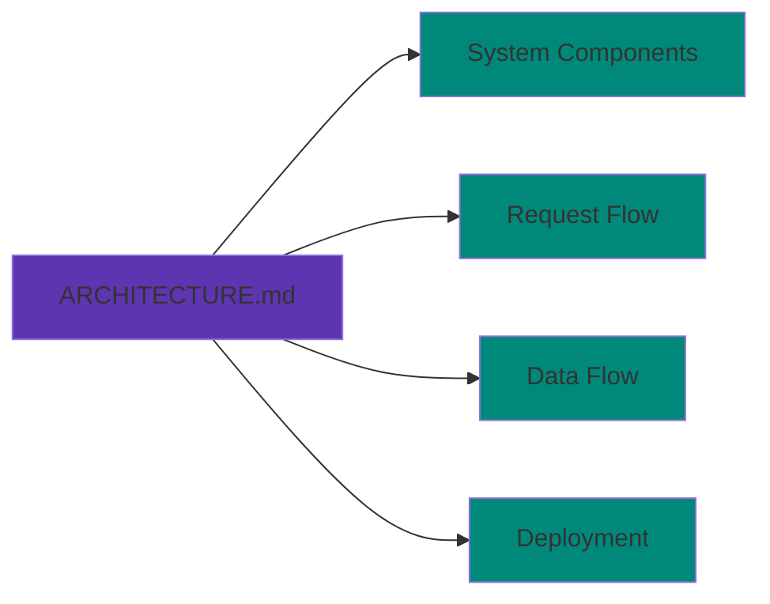
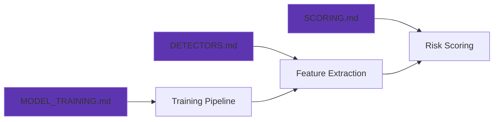
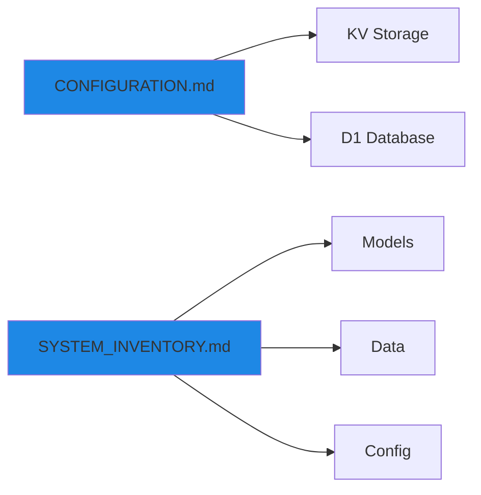
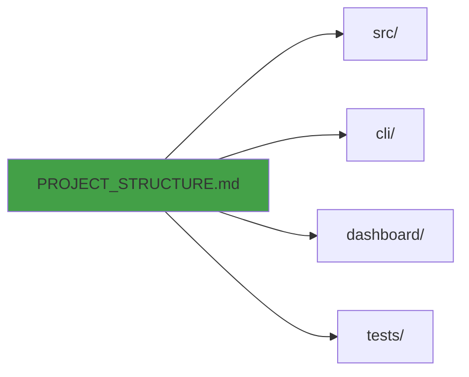

# Markov Mail Documentation

**Version**: 3.0.0
**Last Updated**: 2025-11-30

Welcome to the Markov Mail fraud detection system documentation. This guide provides comprehensive information about the architecture, configuration, and operation of the email fraud detection API.

## 📚 Documentation Index

### Getting Started

| Document | Description | Audience |
|----------|-------------|----------|
| [ARCHITECTURE.md](./ARCHITECTURE.md) | System components, data flow, deployment architecture | Developers, DevOps |
| [CONFIGURATION.md](./CONFIGURATION.md) | KV, D1, and environment setup | Operators, DevOps |
| [PROJECT_STRUCTURE.md](./PROJECT_STRUCTURE.md) | Codebase organization and file structure | Developers |

### Core Concepts

| Document | Description | Audience |
|----------|-------------|----------|
| [SCORING.md](./SCORING.md) | Risk scoring engine, thresholds, actions | All users |
| [DETECTORS.md](./DETECTORS.md) | Feature extraction and detectors reference | ML Engineers, Developers |
| [MODEL_TRAINING.md](./MODEL_TRAINING.md) | Unified Random Forest/Decision Tree training workflow | ML Engineers |

### Operations

| Document | Description | Audience |
|----------|-------------|----------|
| [SYSTEM_INVENTORY.md](./SYSTEM_INVENTORY.md) | Complete system inventory (models, data, config) | Operators, Auditors |
| [CALIBRATION.md](./CALIBRATION.md) | Model calibration approach | ML Engineers |
| [THRESHOLD_ARTIFACTS.md](./THRESHOLD_ARTIFACTS.md) | Guardrail artifacts playbook & review checklist | ML Engineers, Reviewers |

## 🚀 Quick Start

### For Developers

```bash
# 1. Clone and install
git clone https://github.com/yourusername/markov-mail
cd markov-mail
npm install

# 2. Set up environment
cp .dev.vars.example .dev.vars
# Edit .dev.vars with your API keys

# 3. Start local development
npm run dev
# Worker runs at http://localhost:8787

# 4. Run tests
npm test
```

**Next Steps**: Read [ARCHITECTURE.md](./ARCHITECTURE.md) for system overview and [PROJECT_STRUCTURE.md](./PROJECT_STRUCTURE.md) for codebase navigation.

### For ML Engineers

```bash
# 1. Export features from dataset
npm run cli features:export --input data/main.csv

# 2. Train Random Forest model
npm run cli model:train -- --n-trees 20 --upload

# 3. Validate production
npm run cli test:batch -- --input data/main.csv \
  --endpoint https://fraud.erfi.dev/validate

# (Optional) full automation with multi-mode export + search
npm run pipeline -- \
  --dataset data/main.csv \
  --export-modes fast,full \
  --search '[{"label":"fast-pass","nTrees":10,"featureMode":"fast"},{"label":"full-depth","nTrees":20,"maxDepth":8,"featureMode":"full"}]' \
  --calibration-retries 1 \
  --upload-model \
  --apply-thresholds \
  --sync-config \
  --config-dry-run

# Resume a failed automation run
npm run pipeline -- --resume tmp/pipeline-runs/2025-12-01-07-30-00

# Full-MX automation (100-tree forest)
npm run pipeline -- \
  --dataset data/main.csv \
  --export-modes full \
  --search '[{"label":"mx-forest","nTrees":100,"featureMode":"full"}]' \
  --calibration-retries 1 \
  --upload-model \
  --apply-thresholds \
  --sync-config \
  --config-dry-run

# Resume the most recent pipeline attempt
npm run pipeline -- --resume latest
```

**Next Steps**: Read [MODEL_TRAINING.md](./MODEL_TRAINING.md) for training workflow and [DETECTORS.md](./DETECTORS.md) for feature engineering details.

### For Operators

```bash
# 1. Check production config
wrangler kv key get config.json --binding CONFIG --remote | jq .

# 2. Check model versions
wrangler kv key list --binding CONFIG --remote

# 3. View analytics dashboard
open https://fraud.erfi.dev/dashboard

# 4. Query D1 database
wrangler d1 execute DB --command="SELECT COUNT(*) FROM ANALYTICS_DATASET" --remote
```

**Next Steps**: Read [CONFIGURATION.md](./CONFIGURATION.md) for KV/D1 setup and [SYSTEM_INVENTORY.md](./SYSTEM_INVENTORY.md) for complete inventory.

## 📖 Documentation by Topic

### Architecture & Design



- **[ARCHITECTURE.md](./ARCHITECTURE.md)**: Complete system architecture with Mermaid diagrams covering components, request flow, model architecture, data flow, storage, deployment, security, monitoring, and scalability.

### Model Training & ML



- **[MODEL_TRAINING.md](./MODEL_TRAINING.md)**: Unified Random Forest/Decision Tree training workflow, conflict zone weighting, model versioning, and performance metrics.
- **[DETECTORS.md](./DETECTORS.md)**: Complete reference for 12 detector categories covering 45 features, including linguistic analysis, n-gram naturalness, sequential patterns, MX resolution, geo signals, and identity verification.
- **[SCORING.md](./SCORING.md)**: Risk scoring engine details, threshold configuration, action determination, short-circuit rules, score interpretation, and troubleshooting.

### Configuration & Operations



- **[CONFIGURATION.md](./CONFIGURATION.md)**: KV namespace setup, D1 database configuration, environment variables, secrets management, and wrangler.jsonc configuration.
- **[SYSTEM_INVENTORY.md](./SYSTEM_INVENTORY.md)**: Complete inventory of models (RF, DT), datasets (144K emails), configuration files, and deployment artifacts.

### Development & Structure



- **[PROJECT_STRUCTURE.md](./PROJECT_STRUCTURE.md)**: Codebase organization, directory structure, file descriptions, and navigation guide for developers.

## 🔑 Key Concepts

### Feature Extraction Pipeline

Markov Mail uses a **45-feature vector** to represent each email:

```
Email → Detectors → Features → Model → Risk Score → Action
```

**Feature Categories**:
1. **Sequential/Pattern** (2): Sequential confidence, plus-addressing risk
2. **Linguistic** (6): Pronounceability, vowel ratio, consonant clusters
3. **Structural** (4): Word boundaries, segment analysis
4. **Statistical** (4): Entropy, character distribution
5. **Identity** (3): Name similarity, token overlap
6. **Geo** (3): Language/timezone mismatches
7. **MX** (9): Mail provider identification
8. **Domain** (3): TLD risk, reputation
9. **N-gram** (6): Multilingual naturalness + risk
10. **Basic** (5): Length, digit ratio, etc.

See [DETECTORS.md](./DETECTORS.md) for detailed feature descriptions.

### Model Architecture

**Primary**: Random Forest (20 trees, 90.1% precision)
**Fallback**: Decision Tree (1 tree, 75.0% precision)

Both models are stored in KV with 60-second TTL caching for hot-reload without redeployment.

See [MODEL_TRAINING.md](./MODEL_TRAINING.md) for training details.

### Risk Scoring

**Thresholds**:
- **Block** (≥0.65): High confidence fraud
- **Warn** (0.35-0.64): Suspicious but uncertain
- **Allow** (<0.35): Legitimate

See [SCORING.md](./SCORING.md) for scoring logic and threshold tuning.

## 🛠️ Common Tasks

### Update Production Config

```bash
# Edit config file
vim config/production/config.json

# Upload to KV
wrangler kv key put config.json \
  --binding CONFIG \
  --path config/production/config.json \
  --remote
```

See [CONFIGURATION.md](./CONFIGURATION.md#updating-configuration) for details.

### Retrain Models

```bash
# Train Random Forest (production)
npm run cli model:train -- --n-trees 20 --upload

# Train Decision Tree (fallback)
npm run cli model:train -- --n-trees 1 --upload
```

See [MODEL_TRAINING.md](./MODEL_TRAINING.md#training-workflow) for full workflow.

### Test Production API

```bash
# Single email test
npm run cli test:api user@example.com --debug

# Batch test (144K emails)
npm run cli test:batch -- --input data/main.csv \
  --endpoint https://fraud.erfi.dev/validate \
  --concurrency 20
```

See [ARCHITECTURE.md](./ARCHITECTURE.md#testing-strategy) for testing approach.

### Query Analytics

```bash
# Fraud rate over last 7 days
wrangler d1 execute DB --remote --command="
  SELECT DATE(timestamp) as day,
         COUNT(*) as total,
         SUM(CASE WHEN action='block' THEN 1 ELSE 0 END) as blocked
  FROM ANALYTICS_DATASET
  WHERE timestamp >= datetime('now', '-7 days')
  GROUP BY day
"
```

See [CONFIGURATION.md](./CONFIGURATION.md#d1-database) for more queries.

## 📊 System Metrics

### Performance

| Metric | Value | Target |
|--------|-------|--------|
| P50 Latency | 7ms | <10ms ✅ |
| P99 Latency | 45ms | <50ms ✅ |
| Throughput | 10K req/s/region | Unlimited ✅ |
| Model Size | 55KB (RF), 3.3KB (DT) | <100KB ✅ |

### Accuracy

| Metric | Random Forest | Decision Tree |
|--------|---------------|---------------|
| Precision | 90.1% | 75.0% |
| Recall | 92.3% | 80.5% |
| F1 Score | 91.2% | 77.6% |

See [MODEL_TRAINING.md](./MODEL_TRAINING.md#model-performance) for detailed metrics.

## 🔗 External Resources

### Cloudflare Documentation
- [Workers Documentation](https://developers.cloudflare.com/workers/)
- [KV Storage](https://developers.cloudflare.com/kv/)
- [D1 Database](https://developers.cloudflare.com/d1/)
- [Wrangler CLI](https://developers.cloudflare.com/workers/wrangler/)

### Framework Documentation
- [Hono Framework](https://hono.dev/)
- [TypeScript](https://www.typescriptlang.org/)
- [Vitest](https://vitest.dev/)
- [Astro](https://astro.build/)

### Machine Learning
- [scikit-learn Documentation](https://scikit-learn.org/)
- [Random Forest Classifier](https://scikit-learn.org/stable/modules/generated/sklearn.ensemble.RandomForestClassifier.html)
- [Decision Tree Classifier](https://scikit-learn.org/stable/modules/generated/sklearn.tree.DecisionTreeClassifier.html)

## 🆘 Troubleshooting

### Common Issues

| Issue | Document | Section |
|-------|----------|---------|
| Model not loading | [SCORING.md](./SCORING.md#model-not-loading) | Troubleshooting |
| False positives | [SCORING.md](./SCORING.md#score-too-high-false-positives) | Troubleshooting |
| False negatives | [SCORING.md](./SCORING.md#score-too-low-false-negatives) | Troubleshooting |
| Training errors | [MODEL_TRAINING.md](./MODEL_TRAINING.md#troubleshooting) | Troubleshooting |
| KV/D1 issues | [CONFIGURATION.md](./CONFIGURATION.md) | Configuration |

## 📝 Contributing

When updating documentation:

1. **Maintain consistency**: Follow existing format and structure
2. **Update version**: Increment version number in headers
3. **Update dates**: Set "Last Updated" to current date
4. **Link properly**: Use relative paths for cross-references
5. **Test examples**: Verify all command examples work
6. **Add diagrams**: Use Mermaid for visual explanations
7. **Update changelog**: Document significant changes

## 📄 License

See [LICENSE](../LICENSE) file for details.

## 🤝 Support

- **Issues**: [GitHub Issues](https://github.com/yourusername/markov-mail/issues)
- **Discussions**: [GitHub Discussions](https://github.com/yourusername/markov-mail/discussions)
- **Production Support**: Contact the operations team

---

**Last Updated**: 2025-11-30
**Version**: 3.0.0
**Status**: Production Ready ✅
